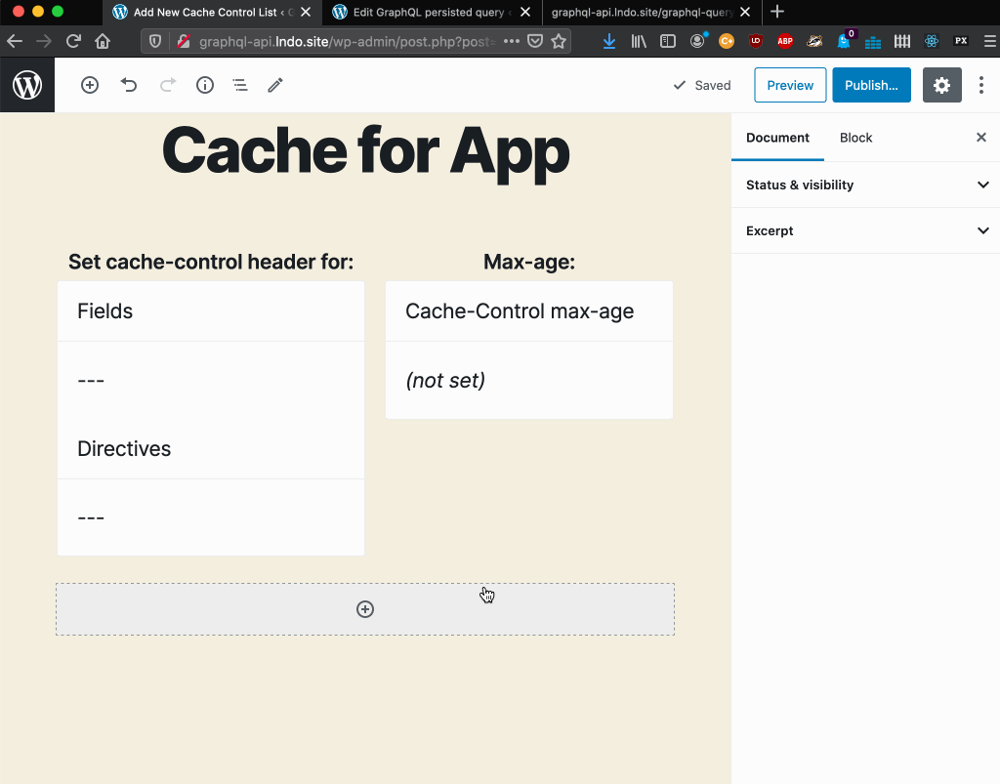
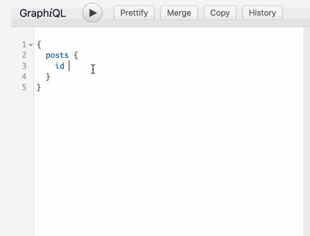
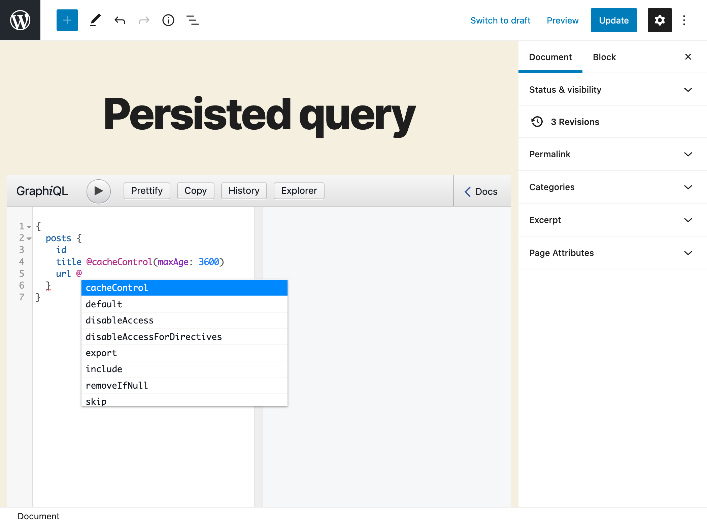

# Low-Level Query Editing

Have access to directives to apply to the schema, already in the persisted queries' editor.

## Description

In GraphQL, directives are functions that enable to modify the result from a field. For instance, a directive `@upperCase` will transform the value of the field into uppercase format.

There are 2 types of directives: those that are applied to the schema and are executed always, on every query; and those that are applied to the query, by the user or the application on the client-side.

In the GraphQL API for WordPress, most functionality involved when resolving a query is executed through directives to be applied to the schema. 

For instance, Cache Control works by applying directive `@cacheControl` on the schema. This configuration is by default hidden, and carried out by the plugin through the user interface:

Similarly, Access Control works by applying directives `@disableAccess`, `@validateIsUserLoggedIn`, `@validateDoesLoggedInUserHaveAnyCapability`, and others.

---

This module "Low-Level Query Editing" makes all directives to be applied to the schema available in the GraphiQL editor when editing persisted queries, allowing to avoid the user interface and add the schema-type directives already in the persisted query.

For instance, defining Cache Control can be done directly in the persisted query, by setting directive `@cacheControl` with argument `maxAge` on the field:

