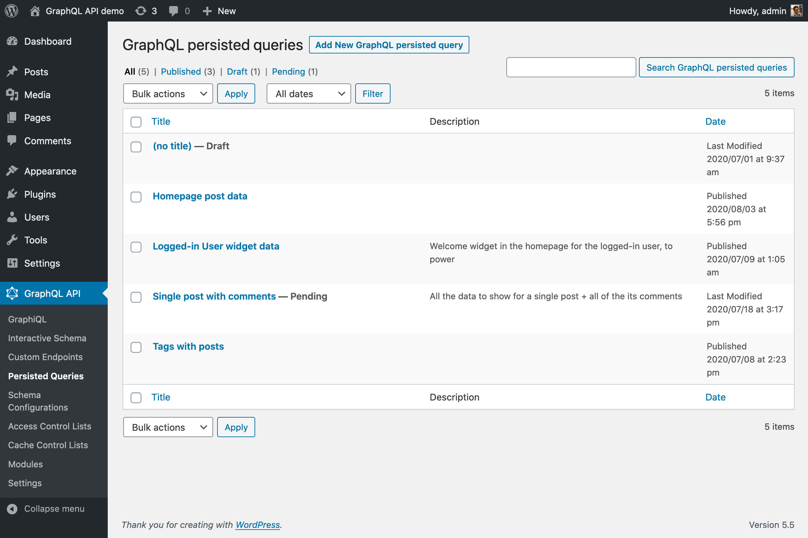
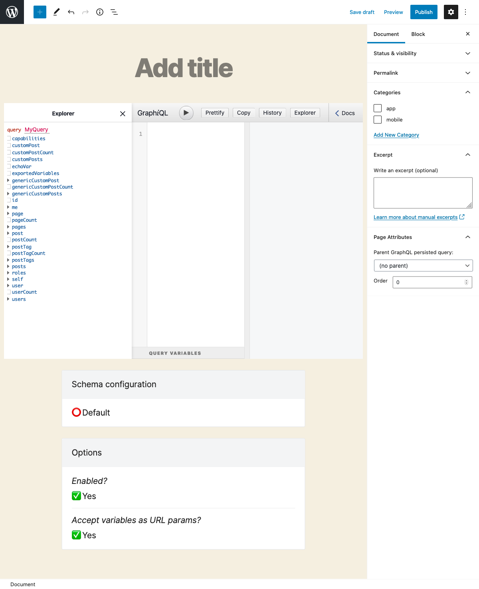

# Persisted Queries

Persisted queries use GraphQL to provide pre-defined enpoints as in REST, obtaining the benefits of both APIs.

---

With **REST**, you create multiple endpoints, each returning a pre-defined set of data.

| Advantages |
| --- |
| ✅ It's simple |
| ✅ Accessed via `GET` or `POST` |
| ✅ Can be cached on the server or CDN |
| ✅ It's secure: only intended data is exposed |

| Disadvantages |
| --- |
| ❌ It's tedious to create all the endpoints |
| ❌ A project may face bottlenecks waiting for endpoints to be ready |
| ❌ Producing documentation is mandatory |
| ❌ It can be slow (mainly for mobile apps), since the application may need several requests to retrieve all the data |

With **GraphQL**, you provide any query to a single endpoint, which returns exactly the requested data.

| Advantages |
| --- |
| ✅ No under/over fetching of data |
| ✅ It can be fast, since all data is retrieved in a single request |
| ✅ It enables rapid iteration of the project |
| ✅ It can be self-documented |
| ✅ It provides an editor for the query (GraphiQL) that simplifies the task |

| Disadvantages |
| --- |
| ❌ Accessed only via `POST` |
| ❌ It can't be cached on the server or CDN, making it slower and more expensive than it could be |
| ❌ It may require to reinvent the wheel, such as uploading files or caching |
| ❌ Must deal with additional complexities, such as the N+1 problem |

**Persisted queries** combine these 2 approaches together:

- It uses GraphQL to create and resolve queries
- But instead of exposing a single endpoint, it exposes every pre-defined query under its own endpoint

Hence, we obtain multiple endpoints with predefined data, as in REST, but these are created using GraphQL, obtaining the advantages from each:

| Advantages |
| --- |
| ✅ Accessed via `GET` or `POST` |
| ✅ Can be cached on the server or CDN |
| ✅ It's secure: only intended data is exposed |
| ✅ No under/over fetching of data |
| ✅ It can be fast, since all data is retrieved in a single request |
| ✅ It enables rapid iteration of the project |
| ✅ It can be self-documented |
| ✅ It provides an editor for the query (GraphiQL) that simplifies the task |

And avoiding their disadvantages:

| Disadvantages |
| --- |
| ~~❌ It's tedious to create all the endpoints~~ |
| ~~❌ A project may face bottlenecks waiting for endpoints to be ready~~ |
| ~~❌ Producing documentation is mandatory~~ |
| ~~❌ It can be slow (mainly for mobile apps), since the application may need several requests to retrieve all the data~~ |
| ~~❌ Accessed only via `POST`~~ |
| ~~❌ It can't be cached on the server or CDN, making it slower and more expensive than it could be~~ |
| ~~❌ It may require to reinvent the wheel , such asuploading files or caching~~ |
| ~~❌ Must deal with additional complexities, such as the N+1 problem~~ 👈🏻 this issue is [resolved by the underlying engine](https://graphql-by-pop.com/docs/architecture/suppressing-n-plus-one-problem.html) |

## How to use

Clicking on the Persisted Queries link in the menu, it displays the list of all the created persisted queries:

A persisted query is a custom post type (CPT). To create a new persisted query, click on button "Add New GraphQL persisted query", which will open the WordPress editor:

These are the inputs in the body of the editor:

| Input | Description | 
| --- | --- |
| Title | Persisted query's title |
| GraphiQL client | Editor to write and execute the GraphQL query:<ul><li>Write the query on the textarea</li><li>Click on the "Run" button to execute the query</li><li>Obtain the results on the input on the right side</li><li>Click on "Docs" to inspect the schema information</li></ul>The Explorer (shown only if module "GraphiQL Explorer" is enabled) allows to click on the fields, and these are automatically added to the query |

These are the inputs in the Document settings:

| Input | Description | 
| --- | --- |
| Permalink | The endpoint under which the persisted query will be available |

## Resources

This video demonstrates how to create a new persisted query:

<iframe src="https://player.vimeo.com/video/443790273?loop=1" width="900" height="507" frameborder="0" allow="autoplay; fullscreen" allowfullscreen></iframe>
